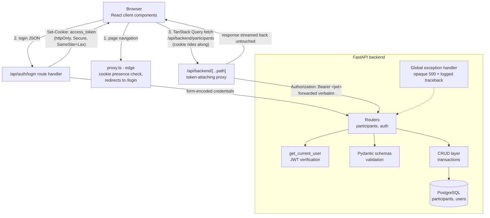

# Architecture

Two applications, one API contract. FastAPI is the single backend; the
Next.js app is a client-rendered SPA whose only server-side code handles the
auth cookie and forwards data requests (ADRs 0006-0008).

## Full request flow

Key properties:

- The JWT never exists in browser-readable space: it is set as an httpOnly
  cookie by the login route handler and attached as a Bearer header by the
  server-side proxy. `document.cookie` shows nothing.
- The proxy forwards verbatim (method, path, query, body, status, error
  bodies). FastAPI's contract is the only API contract; there is no second
  backend and no CORS anywhere (all browser requests are same-origin).
- Route protection is layered: `proxy.ts` redirects for UX (cookie presence
  only), while FastAPI's signature verification is the actual security
  boundary. A forged cookie gets a page shell but no data.
- `/api/auth/me` decodes (does not verify) the JWT to tell the UI who is
  logged in; it is advisory, never an authorization boundary.

## Frontend layers

| Layer | Location | Owns |
|---|---|---|
| Pages | `frontend/app/*/page.tsx` | Client Components; state branching (loading/error/empty/data) |
| Route handlers | `frontend/app/api/` | Auth cookie (login/logout/me) + the data proxy; the only server-side code |
| Edge proxy | `frontend/proxy.ts` | Redirect-level route protection (Next 16 name for middleware) |
| Components | `frontend/components/` | Presentational: table, form, tiles, bars, states |
| Hooks | `frontend/hooks/` | TanStack Query hooks (`useParticipants`, `useCreateParticipant`) |
| Context | `frontend/context/` | Auth status + username; never the token |
| API client | `frontend/lib/api/` | Typed fetch wrapper + per-resource functions; 401 -> re-login |
| Domain logic | `frontend/lib/` | Pure, unit-tested: form validation mirror, metrics aggregation |
| Types | `frontend/types/` | TS mirrors of the Pydantic schemas + shared enum arrays |

## Backend layers

| Layer | Location | Owns |
|---|---|---|
| Routers | `app/routers/` | HTTP: status codes, auth wiring, error translation |
| Schemas | `app/schemas/` | API shape: validation, serialization (Pydantic v2) |
| CRUD | `app/crud/` | Persistence: queries, transaction boundaries |
| Models | `app/models/` | DB shape: tables, constraints, enums (SQLAlchemy) |
| Security | `app/security.py` | Hashing, JWT issue/verify, `get_current_user` |
| Config | `app/config.py` | Environment-driven settings (pydantic-settings) |

Mechanics: sessions are per-request via the `DbSession` dependency with
explicit commits in CRUD (ADR 0001); startup runs `create_all` plus an
idempotent seed user (ADR 0003); expected errors raise `HTTPException`,
everything else hits the catch-all handler (ADR 0004).

## Decision records

`docs/adr/` - 0001 session handling, 0002 JWT auth, 0003 seed user,
0004 error handling, 0005 test database, 0006 Next.js as client-side SPA,
0007 httpOnly cookie, 0008 token-attaching proxy, 0009 form validation,
0010 invalidation over optimistic updates.
