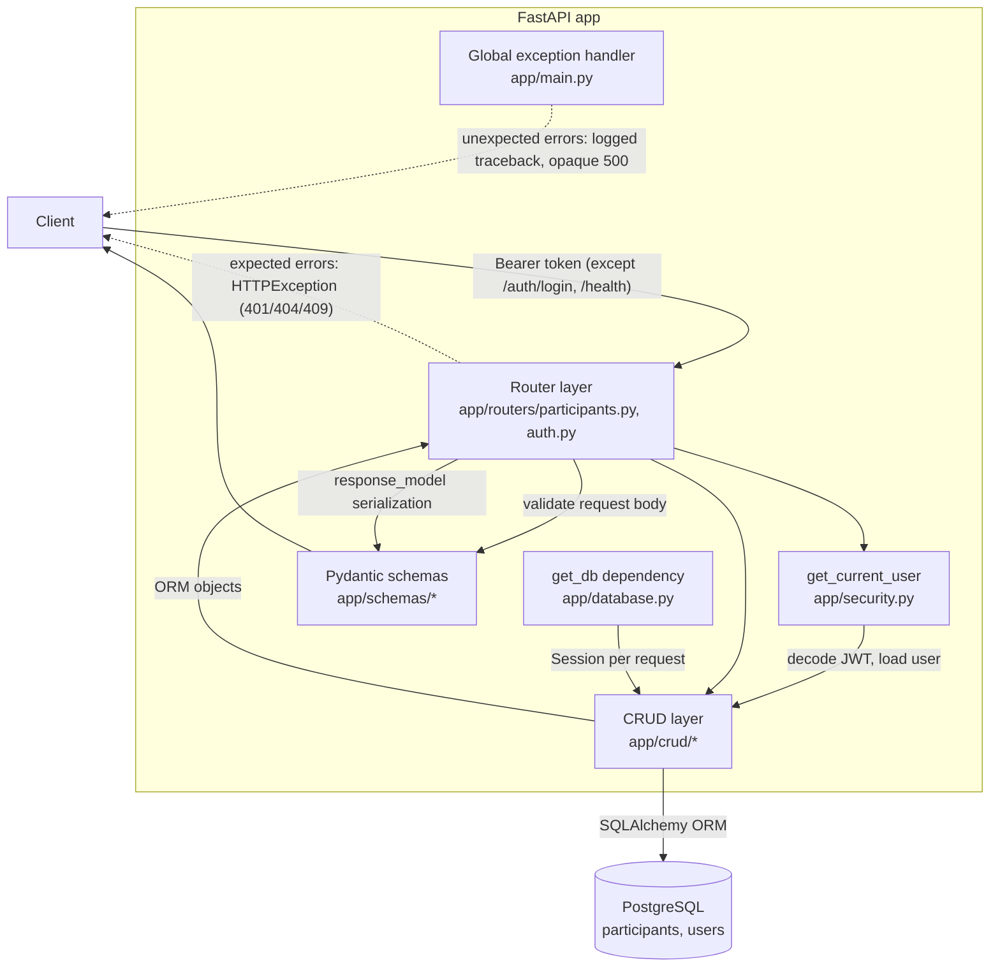

# Architecture

## Request flow

## Layer responsibilities

| Layer | Location | Owns |
|---|---|---|
| Routers | `app/routers/` | HTTP: status codes, auth wiring, error translation |
| Schemas | `app/schemas/` | API shape: validation, serialization (Pydantic v2) |
| CRUD | `app/crud/` | Persistence: queries, transaction boundaries |
| Models | `app/models/` | DB shape: tables, constraints, enums (SQLAlchemy) |
| Security | `app/security.py` | Hashing, JWT issue/verify, `get_current_user` |
| Config | `app/config.py` | Environment-driven settings (pydantic-settings) |

Key mechanics:

- **Auth** is a router-level dependency on the participants router; every
  route under it requires a valid JWT, and `/auth/login` + `/health` stay
  public.
- **Sessions** are per-request via `get_db`, exposed to endpoints as the
  `DbSession` annotated type. CRUD functions commit explicitly.
- **Startup** (lifespan): `create_all` for tables, then idempotent seed of
  the configured bootstrap user.
- **Errors**: routers raise `HTTPException` for expected cases; anything
  else hits the catch-all handler, which logs the traceback and returns
  `{"detail": "Internal server error"}`.

Decision records: see `docs/adr/`.
